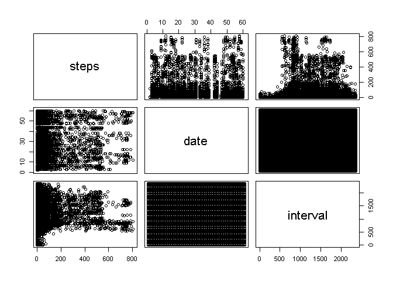
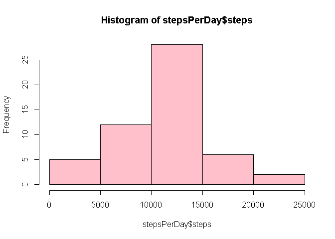
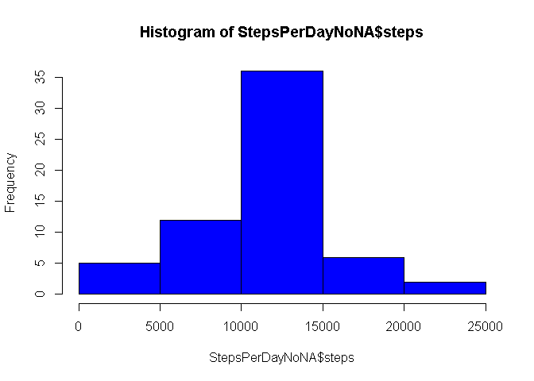
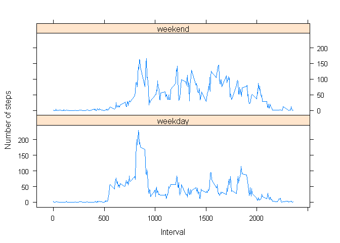

## Loading and preprocessing the data

```r
library(readr)
setwd("~/RepData_PeerAssessment1")
unzip("./activity.zip")
activity<- read.csv("./activity.csv", sep = ",", stringsAsFactors = TRUE)
summary(activity)
```

```
##      steps                date          interval     
##  Min.   :  0.00   2012-10-01:  288   Min.   :   0.0  
##  1st Qu.:  0.00   2012-10-02:  288   1st Qu.: 588.8  
##  Median :  0.00   2012-10-03:  288   Median :1177.5  
##  Mean   : 37.38   2012-10-04:  288   Mean   :1177.5  
##  3rd Qu.: 12.00   2012-10-05:  288   3rd Qu.:1766.2  
##  Max.   :806.00   2012-10-06:  288   Max.   :2355.0  
##  NA's   :2304     (Other)   :15840
```

```r
names(activity)
```

```
## [1] "steps"    "date"     "interval"
```

```r
head(activity)
```

```
##   steps       date interval
## 1    NA 2012-10-01        0
## 2    NA 2012-10-01        5
## 3    NA 2012-10-01       10
## 4    NA 2012-10-01       15
## 5    NA 2012-10-01       20
## 6    NA 2012-10-01       25
```

```r
pairs(activity)
```

<!-- -->

## What is mean total number of steps taken per day?

1.Calculate the total number of steps taken per day

```r
stepsPerDay <- aggregate(steps ~ date, activity, sum, na.rm=TRUE)
```

2.Making a histogram of the total number of steps taken each day.

```r
hist(stepsPerDay$steps, col="pink")
```

<!-- -->

3.Calculate and report the mean and median of the total number of steps taken per day.

```r
meanStepsPerDay <- mean(stepsPerDay$steps)
meanStepsPerDay
```

```
## [1] 10766.19
```

```r
medianStepsPerDay <- median(stepsPerDay$steps)
medianStepsPerDay
```

```
## [1] 10765
```

-The mean total number of steps taken each day is stored in variable [meanStepsPerDay]
-The median total number of steps taken each day is stored in variable [medianStepsPerDay]

## What is the average daily activity pattern?

1.Make a time series plot (i.e. 𝚝𝚢𝚙𝚎 = “𝚕”) of the 5-minute interval (x-axis) and the average number of steps taken, averaged across all days (y-axis)


```r
stepsPerInterval<-aggregate(steps~interval, data=activity, mean, na.rm=TRUE)
plot(steps~interval, data=stepsPerInterval, type="l")
```

<!-- -->
2.Which 5-minute interval, on average across all the days in the dataset, contains the maximum number of steps?


```r
maxsteps<- stepsPerInterval[which.max(stepsPerInterval$steps),]$interval
maxsteps
```

```
## [1] 835
```
- The 5-minute interval accross all the days containing the maximum number of steps is stored in variable [maxteps].

## Imputing missing values
1.Calculate and report the total number of missing values in the dataset (i.e. the total number of rows with 𝙽𝙰s)


```r
missingdata<- sum(is.na(activity))
missingdata
```

```
## [1] 2304
```

- The total number of missing values in the dataset is stored in the variable [missingdata].

2.Devise a strategy for filling in all of the missing values in the dataset. The strategy does not need to be sophisticated. For example, you could use the mean/median for that day, or the mean for that 5-minute interval, etc.
-we’ll fill in all the missing values in the dataset with the mean per date. 


```r
getMeanSteps<-function(interval){
    stepsPerInterval[stepsPerInterval$interval==interval,]$steps
}
```
3.Create a new dataset that is equal to the original dataset but with the missing data filled in.

```r
activityNoNA<-activity
for(i in 1:nrow(activityNoNA)){
    if(is.na(activityNoNA[i,]$steps)){
        activityNoNA[i,]$steps <- getMeanSteps(activityNoNA[i,]$interval)
    }
}
```
- The new data set with no missing values is contained in the variable [activityNoNA]
4.Make a histogram of the total number of steps taken each day and Calculate and report the mean and median total number of steps taken per day. Do these values differ from the estimates from the first part of the assignment? What is the impact of imputing missing data on the estimates of the total daily number of steps?


```r
StepsPerDayNoNA <- aggregate(steps ~ date, data=activityNoNA, sum)
hist(StepsPerDayNoNA$steps, col="blue")
```

<!-- -->

```r
meanStepsPerDayNoNA <- mean(StepsPerDayNoNA$steps)
medianStepsPerDayNoNA <- median(StepsPerDayNoNA$steps)
meanStepsPerDayNoNA
```

```
## [1] 10766.19
```

```r
medianStepsPerDayNoNA
```

```
## [1] 10766.19
```

-The mean total number of steps taken each day with no missing values is stored in variable [meanStepsPerDayNoNA]
-The median total number of steps taken each day with no missing values is stored in variable [medianStepsPerDayNoNA]
The mean didn’t change after the replacements of NAs, the median changed about 0.1% of the original value.

## Are there differences in activity patterns between weekdays and weekends?

1.Create a new factor variable in the dataset with two levels – “weekday” and “weekend” indicating whether a given date is a weekday or weekend day.


```r
activityNoNA$date <- as.Date(strptime(activityNoNA$date, format="%Y-%m-%d"))
activityNoNA$day <- weekdays(activityNoNA$date)
for (i in 1:nrow(activityNoNA)) {
    if (activityNoNA[i,]$day %in% c("Saturday","Sunday")) {
        activityNoNA[i,]$day<-"weekend"
    }
    else{
        activityNoNA[i,]$day<-"weekday"
    }
}
stepsByDay <- aggregate(activityNoNA$steps ~ activityNoNA$interval + activityNoNA$day, activityNoNA, mean)
```

2.Make a panel plot containing a time series plot (i.e. 𝚝𝚢𝚙𝚎 = “𝚕”) of the 5-minute interval (x-axis) and the average number of steps taken, averaged across all weekday days or weekend days (y-axis). See the README file in the GitHub repository to see an example of what this plot should look like using simulated data.


```r
names(stepsByDay) <- c("interval", "day", "steps")
library(lattice)
xyplot(steps ~ interval | day, stepsByDay, type = "l", layout = c(1, 2), 
    xlab = "Interval", ylab = "Number of steps")
```

<!-- -->


